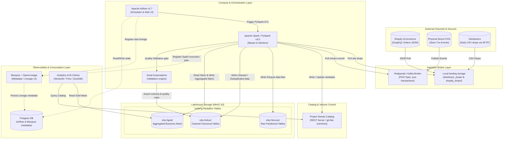
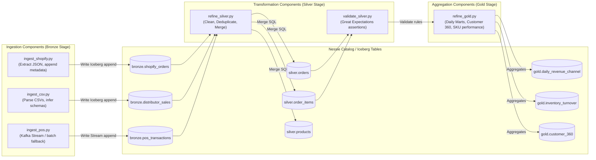

# CartCo Unified Commerce Lakehouse C4 Architecture Model

This document describes the architectural layout of the CartCo Medallion Lakehouse platform using the C4 Model format (Container and Component views).

---

## 1. Container Diagram (System Level)

The Container Diagram illustrates the high-level boundaries of the data platform, showing how external systems feed data in, how the compute/storage engines are arranged, and how analysts/observability platforms interact with the stack.

---

## 2. Component Diagram (Transformation Pipelines)

The Component Diagram zooms into the **Compute & Orchestration Container** to show how specific jobs, operators, and validation suites interact to move data across the Bronze, Silver, and Gold layers.

